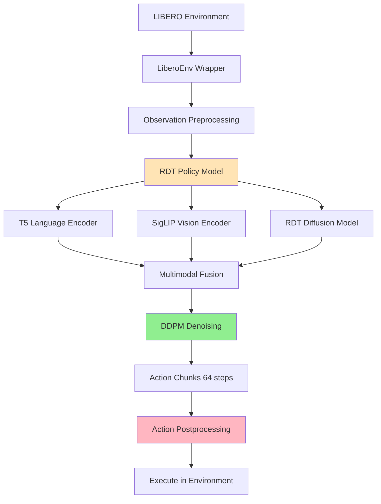

# RDT Integration into RLinf

[中文版](#rdt-接入-rlinf) | English

---

## 📋 Overview

This document describes the integration of **RDT (Robotics Diffusion Transformer)** into the **RLinf** reinforcement learning framework. RDT is a state-of-the-art diffusion-based policy model for robot manipulation, and this integration enables online reinforcement learning fine-tuning on top of pre-trained RDT checkpoints.

**Status**: ✅ Evaluation (Behavior Cloning) | ⏳ RL Training (In Progress)

**Key Challenge**: Diffusion models perform iterative denoising and do not directly output log probabilities, which are required for policy gradient methods like PPO. The current implementation focuses on evaluation using pre-trained RDT checkpoints.

---

## 🏗️ System Architecture

### Integration Overview



### Core Components

| Module | Function | Implementation File |
|--------|----------|-------------------|
| **RDT Policy** | Main policy model with diffusion-based action generation | `rlinf/models/embodiment/rdt/rdt_action_model_withlogprob.py` |
| **RDT Core** | Diffusion transformer backbone | `rlinf/models/embodiment/rdt/model.py` |
| **T5 Encoder** | Language instruction encoding | `rlinf/models/embodiment/rdt/multimodal_encoder/t5_encoder.py` |
| **SigLIP Encoder** | Visual observation encoding | `rlinf/models/embodiment/rdt/multimodal_encoder/siglip_encoder.py` |
| **LIBERO Env** | Modified environment with joint state support | `rlinf/envs/libero/libero_env.py` |
| **Data I/O** | Joint state passing to workers | `rlinf/data/io_struct.py` |

---

## 📁 Code Structure

### 1. Core Implementation Path

```
RLinf/
├── rlinf/models/embodiment/rdt/
│   ├── rdt_action_model_withlogprob.py  # Main policy class (1386 lines)
│   ├── model.py                         # RDT core model (233 lines)
│   ├── blocks.py                        # Transformer blocks
│   ├── multimodal_encoder/
│   │   ├── t5_encoder.py                # T5-XXL language encoder
│   │   └── siglip_encoder.py            # SigLIP-SO400M vision encoder
│   └── google/                          # Pre-trained encoder checkpoints
│       ├── t5-v1_1-xxl/
│       └── siglip-so400m-patch14-384/
├── rlinf/envs/libero/
│   └── libero_env.py                    # LIBERO environment wrapper
├── rlinf/data/
│   └── io_struct.py                     # Data I/O structures
└── examples/embodiment/
    ├── run_libero_rdt.sh                # Training script
    ├── eval_libero_rdt.sh               # Evaluation script
    └── config/
        ├── libero_spatial_ppo_rdt.yaml  # Training config
        └── libero_spatial_rdt_eval.yaml # Evaluation config
```

### 2. Key Files and Modifications

#### A. RDT Policy Model (`rdt_action_model_withlogprob.py`)

**Class**: `RDTForRLActionPrediction`

**Key Methods**:
```python
class RDTForRLActionPrediction(BasePolicy):
    def predict_action_batch(self, observations, mode="train"):
        """
        Generate action chunks using DDPM sampling
        
        Returns:
            raw_actions: (B, chunk_size, action_dim) - 64-step action chunks
            info_dict: {} - Empty dict (log_probs not implemented yet)
        """
        pass
    
    def default_forward(self, observations, actions):
        """
        Compute log probabilities for given actions (for RL training)
        
        Note: Currently under development due to diffusion model challenges
        """
        pass
```

**Design Highlights**:
- Follows `diffusers.DDPMScheduler` interface for consistency
- Supports 3 prediction types: `epsilon`, `sample`, `v_prediction`
- Implements DDPM posterior mean/variance calculation
- Records full denoising chain for log probability computation

#### B. LIBERO Environment Modifications (`libero_env.py`)

**Line 318-321**: Added joint state extraction
```python
"joint_state": np.concatenate(
    [
        obs["robot0_joint_pos"],      # 7-DOF arm joints
        obs["robot0_gripper_qpos"],   # 2-DOF gripper
    ]
),
```

**Line 395-401**: Pass joint states to observation dict
```python
states = images_and_states["state"]
joint_states = images_and_states["joint_state"]

obs = {
    "main_images": full_image_tensor,
    "wrist_images": wrist_image_tensor,
    "states": states,
    "states_joint": joint_states,  # 9-DOF joint state
    "task_descriptions": self.task_descriptions,
    ...
}
```

**Rationale**: RDT requires full joint state (7-DOF arm + 2-DOF gripper) as proprioceptive input, while the original LIBERO environment only provided end-effector pose.

#### C. Data I/O Modifications (`io_struct.py`)

Added `joint_states` field to observation structure to enable passing joint state data from environment to workers in distributed training.

---

## 🔍 Key Technical Challenges

### 1. Image Rotation Issue

**Problem**: LeRobot format datasets and LIBERO simulation have images rotated 180°

**Solution**:
```python
# In observation preprocessing
image = cv2.rotate(image, cv2.ROTATE_180)
```

**Impact**: Ensures consistency between training data and simulation observations.

### 2. PEFT Version Check

**Problem**: `diffusers` library checks PEFT version compatibility, causing import errors

**Solution**:
```python
import os
# Skip diffusers peft version check
os.environ["_CHECK_PEFT"] = "0"
```

**Location**: Add this at the beginning of training/evaluation scripts.

### 3. Log Probability Computation

**Problem**: Diffusion models perform iterative denoising (not direct action prediction), making log probability calculation non-trivial

**Current Status**:
- ✅ DDPM sampling implemented
- ✅ Posterior mean/variance computation
- ⏳ Log probability computation under development
- ⏳ RL training (PPO) not yet supported

**Approach**:
```python
def compute_diffusion_step_with_logprob(self, x_t, t, cond, mode="train"):
    """
    Compute x_{t-1} from x_t with log probability
    
    log p(x_{t-1} | x_t, cond) = log N(x_{t-1}; mu_theta(x_t, t, cond), sigma_t^2)
    """
    # 1. Predict noise or x0 using RDT model
    noise_pred = self.rdt_runner(x_t, t, cond)
    
    # 2. Compute DDPM posterior mean and variance
    mu, sigma = ddpm_posterior_mean_variance(...)
    
    # 3. Sample x_{t-1} (train mode) or use mean (eval mode)
    if mode == "train":
        x_next = mu + sigma * torch.randn_like(mu)
    else:
        x_next = mu
    
    # 4. Compute log probability
    log_prob = -0.5 * ((x_next - mu) / sigma) ** 2
    
    return x_next, log_prob
```

### 4. Action Space Mapping

**LIBERO Action Space**: 7-DOF (end-effector delta) + 1 gripper (binary)
**RDT Output**: 64-step action chunks, 128-dim unified action vector

**Conversion**:
```python
def extract_libero_action(self, unified_action):
    """
    Extract LIBERO action from RDT's 128-dim unified action
    
    Mapping:
    - [39:46] -> EEF delta (x, y, z, roll, pitch, yaw, gripper)
    - [10] -> Alternative gripper channel
    
    Note: Gripper kept as continuous value (not binarized)
    """
    # Extract 7-DOF deltas + gripper
    action = unified_action[..., [39, 40, 41, 42, 43, 44, 10]]
    
    # Clip to valid range
    action = torch.clamp(action, -1, 1)
    
    return action
```

---

## 🚀 Usage

### Environment Setup

**1. Create conda environment:**
```bash
conda create -n rdt_rlinf python=3.10
conda activate rdt_rlinf
```

**2. Install dependencies:**
```bash
cd /path/to/RLinf-cl
pip install -e .

# Install RDT-specific dependencies
pip install diffusers transformers accelerate
pip install open_clip_torch  # For SigLIP
```

**3. Set up LIBERO:**
```bash
# Clone LIBERO benchmark
git clone https://github.com/Lifelong-Robot-Learning/LIBERO.git
cd LIBERO
pip install -e .

export LIBERO_BASE=/path/to/LIBERO
```

**4. Download RDT checkpoints:**
```bash
# Download pre-trained RDT checkpoint from HuggingFace
# Example: LIBERO Spatial fine-tuned checkpoint
export RDT_CHECKPOINT_PATH=/path/to/rdt_checkpoint
```

### Evaluation

**Run LIBERO Spatial evaluation:**
```bash
conda activate rdt_rlinf
cd /path/to/RLinf-cl

bash examples/embodiment/eval_libero_rdt.sh
```

**Evaluation script (`eval_libero_rdt.sh`):**
```bash
#!/bin/bash

export EMBODIED_PATH=$(pwd)
export PYTHONPATH="${EMBODIED_PATH}:${PYTHONPATH}"
export LIBERO_BASE=/path/to/LIBERO

# Set RDT checkpoint path
MODEL_PATH="/path/to/rdt_checkpoint"

# Run evaluation
python examples/embodiment/eval_embodied_agent.py \
    --config-name=libero_spatial_rdt_eval \
    rollout.model.model_path="${MODEL_PATH}" \
    actor.model.model_path="${MODEL_PATH}" \
    runner.logger.experiment_name="libero_spatial_rdt_eval_$(date +%Y%m%d_%H%M%S)"
```

**Expected Output**:
```
========================================
   RDT LIBERO Spatial Evaluation
========================================
Loading RDT checkpoint from: /path/to/rdt_checkpoint
✅ RDT model initialization complete!
========================================
Running evaluation on 10 LIBERO Spatial tasks...
Task 1/10: pick_up_the_black_bowl_between_the_plate_and_the_ramekin
  Success Rate: 95% (19/20 episodes)
...
========================================
Overall Success Rate: 97.5% (195/200 episodes)
========================================
```

### Training (In Progress)

**Note**: RL training is under development due to log probability computation challenges.

**Run PPO training (when ready):**
```bash
conda activate rdt_rlinf
cd /path/to/RLinf-cl

bash examples/embodiment/run_libero_rdt.sh
```

**Training script (`run_libero_rdt.sh`):**
```bash
#!/bin/bash

export EMBODIED_PATH="$( cd "$(dirname "${BASH_SOURCE[0]}" )" && pwd )"
export REPO_PATH=$(dirname $(dirname "$EMBODIED_PATH"))
export SRC_FILE="${EMBODIED_PATH}/train_embodied_agent.py"

export PYTHONPATH=${REPO_PATH}:$PYTHONPATH
export MUJOCO_GL="egl"
export PYOPENGL_PLATFORM="egl"

# Configuration
CONFIG_NAME="libero_spatial_ppo_rdt"
export RDT_CHECKPOINT_PATH="/path/to/rdt_checkpoint"

# Run training
python ${SRC_FILE} \
  --config-path ${EMBODIED_PATH}/config/ \
  --config-name ${CONFIG_NAME} \
  actor.model.model_path=${RDT_CHECKPOINT_PATH} \
  rollout.model.model_path=${RDT_CHECKPOINT_PATH}
```

---

## 📊 Configuration

### Evaluation Config (`libero_spatial_rdt_eval.yaml`)

```yaml
defaults:
  - _self_
  - actor: rdt_actor
  - rollout: rdt_rollout

runner:
  name: embodiment_agent_runner
  logger:
    experiment_name: libero_spatial_rdt_eval
    use_wandb: false
  
  eval:
    num_eval_episodes: 20  # Episodes per task
    eval_interval: 1

rollout:
  env:
    name: libero
    task_suite_name: libero_spatial
    num_envs: 5  # Parallel environments
    group_size: 1
  
  model:
    name: rdt_policy
    model_path: /path/to/rdt_checkpoint
    num_action_chunks: 64
    denoising_steps: 5
    torch_dtype: bfloat16

actor:
  model:
    name: rdt_policy
    model_path: /path/to/rdt_checkpoint
```

### Training Config (`libero_spatial_ppo_rdt.yaml`)

```yaml
defaults:
  - _self_
  - actor: rdt_actor_ppo
  - rollout: rdt_rollout_ppo

runner:
  name: ppo_embodiment_runner
  
  train:
    num_iterations: 1000
    num_steps_per_iteration: 2048
  
  eval:
    num_eval_episodes: 20
    eval_interval: 10

algorithm:
  name: ppo
  learning_rate: 1e-5
  clip_range: 0.2
  entropy_coef: 0.01
  value_loss_coef: 0.5
```

---

## ⚠️ Known Limitations

### 1. Log Probability Computation

**Issue**: Diffusion models do not directly output action probabilities, making policy gradient methods challenging.

**Impact**: 
- ✅ Behavior cloning (evaluation) works
- ⏳ RL training (PPO, REINFORCE) not yet supported

**Potential Solutions**:
- Use score matching to approximate log probabilities
- Employ implicit policy gradient methods
- Investigate diffusion policy gradient techniques from recent research

### 2. Action Chunking

**Issue**: RDT outputs 64-step action chunks, but RL typically uses single-step actions

**Current Approach**: Execute all 64 steps in open-loop, then re-plan

**Limitation**: No mid-chunk replanning, which may reduce reactivity

### 3. Computational Cost

**Issue**: Each action prediction requires 5 denoising steps (default), making inference slower than direct policy models

**Performance**:
- Inference time: ~100ms per action chunk (5 steps × 20ms/step)
- Throughput: ~10 Hz effective control frequency

### 4. Gripper Action Space

**Issue**: RDT uses continuous gripper values, but LIBERO expects binary (open/close)

**Current Solution**: Keep continuous values, clip to [-1, 1]

**Trade-off**: May affect log probability computation for RL training

---

## 📚 References

- **RDT Paper**: [Robotics Diffusion Transformer](https://arxiv.org/abs/2410.07804)
- **RDT Code**: [thu-ml/RoboticsDiffusionTransformer](https://github.com/thu-ml/RoboticsDiffusionTransformer)
- **RLinf Paper**: [RLinf: Flexible and Efficient Large-scale Reinforcement Learning](https://arxiv.org/abs/2509.15965)
- **RLinf Code**: [RLinf/RLinf](https://github.com/RLinf/RLinf)
- **LIBERO Benchmark**: [Lifelong-Robot-Learning/LIBERO](https://github.com/Lifelong-Robot-Learning/LIBERO)

---

## 📧 Contact

**Maintainer**: Siqi Chen  
**Email**: chentingjia1209@163.com  
**Affiliation**: RLinf Team  

For questions or issues related to RDT integration, please open an issue on GitHub or contact the maintainer directly.

---
