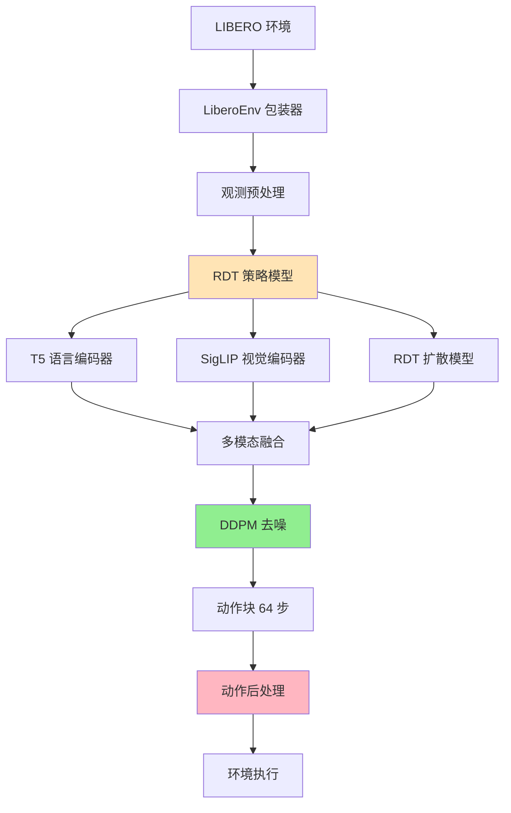

# RDT 接入 RLinf

[English](#rdt-integration-into-rlinf) | 中文版

---

## 📋 概述

本文档描述了将 **RDT（Robotics Diffusion Transformer）** 集成到 **RLinf** 强化学习框架的过程。RDT 是一个基于扩散模型的先进机器人操作策略模型，此集成使得可以在预训练的 RDT 检查点基础上进行在线强化学习微调。

**当前状态**: ✅ 评估（行为克隆） | ⏳ RL 训练（开发中）

**核心挑战**：扩散模型通过迭代去噪生成动作，不直接输出对数概率，而对数概率是 PPO 等策略梯度方法所必需的。当前实现主要关注使用预训练 RDT 检查点进行评估。

---

## 🏗️ 系统架构

### 集成概览



### 核心组件

| 模块 | 功能 | 实现文件 |
|------|------|---------|
| **RDT 策略** | 基于扩散的动作生成主策略模型 | `rlinf/models/embodiment/rdt/rdt_action_model_withlogprob.py` |
| **RDT 核心** | 扩散 Transformer 主干网络 | `rlinf/models/embodiment/rdt/model.py` |
| **T5 编码器** | 语言指令编码 | `rlinf/models/embodiment/rdt/multimodal_encoder/t5_encoder.py` |
| **SigLIP 编码器** | 视觉观测编码 | `rlinf/models/embodiment/rdt/multimodal_encoder/siglip_encoder.py` |
| **LIBERO 环境** | 支持关节状态的修改环境 | `rlinf/envs/libero/libero_env.py` |
| **数据 I/O** | 向 worker 传递关节状态 | `rlinf/data/io_struct.py` |

---

## 📁 代码结构

### 1. 核心实现路径

```
RLinf/
├── rlinf/models/embodiment/rdt/
│   ├── rdt_action_model_withlogprob.py  # 主策略类 (1386 行)
│   ├── model.py                         # RDT 核心模型 (233 行)
│   ├── blocks.py                        # Transformer 块
│   ├── multimodal_encoder/
│   │   ├── t5_encoder.py                # T5-XXL 语言编码器
│   │   └── siglip_encoder.py            # SigLIP-SO400M 视觉编码器
│   └── google/                          # 预训练编码器检查点
│       ├── t5-v1_1-xxl/
│       └── siglip-so400m-patch14-384/
├── rlinf/envs/libero/
│   └── libero_env.py                    # LIBERO 环境包装器
├── rlinf/data/
│   └── io_struct.py                     # 数据 I/O 结构
└── examples/embodiment/
    ├── run_libero_rdt.sh                # 训练脚本
    ├── eval_libero_rdt.sh               # 评估脚本
    └── config/
        ├── libero_spatial_ppo_rdt.yaml  # 训练配置
        └── libero_spatial_rdt_eval.yaml # 评估配置
```

### 2. 关键文件和修改

#### A. RDT 策略模型 (`rdt_action_model_withlogprob.py`)

**类**: `RDTForRLActionPrediction`

**关键方法**:
```python
class RDTForRLActionPrediction(BasePolicy):
    def predict_action_batch(self, observations, mode="train"):
        """
        使用 DDPM 采样生成动作块
        
        返回:
            raw_actions: (B, chunk_size, action_dim) - 64 步动作块
            info_dict: {} - 空字典（log_probs 尚未实现）
        """
        pass
    
    def default_forward(self, observations, actions):
        """
        计算给定动作的对数概率（用于 RL 训练）
        
        注意：由于扩散模型的挑战，目前仍在开发中
        """
        pass
```

**设计亮点**:
- 遵循 `diffusers.DDPMScheduler` 接口以保持一致性
- 支持 3 种预测类型：`epsilon`、`sample`、`v_prediction`
- 实现 DDPM 后验均值/方差计算
- 记录完整去噪链以计算对数概率

#### B. LIBERO 环境修改 (`libero_env.py`)

**第 318-321 行**：添加关节状态提取
```python
"joint_state": np.concatenate(
    [
        obs["robot0_joint_pos"],      # 7-DOF 机械臂关节
        obs["robot0_gripper_qpos"],   # 2-DOF 夹爪
    ]
),
```

**第 395-401 行**：将关节状态传递到观测字典
```python
states = images_and_states["state"]
joint_states = images_and_states["joint_state"]

obs = {
    "main_images": full_image_tensor,
    "wrist_images": wrist_image_tensor,
    "states": states,
    "states_joint": joint_states,  # 9-DOF 关节状态
    "task_descriptions": self.task_descriptions,
    ...
}
```

**原理**：RDT 需要完整的关节状态（7-DOF 机械臂 + 2-DOF 夹爪）作为本体感知输入，而原始 LIBERO 环境只提供末端执行器位姿。

#### C. 数据 I/O 修改 (`io_struct.py`)

在观测结构中添加了 `joint_states` 字段，以便在分布式训练中将关节状态数据从环境传递到 worker。

---

## 🔍 关键技术挑战

### 1. 图像旋转问题

**问题**：LeRobot 格式数据集和 LIBERO 仿真中的图像旋转了 180°

**解决方案**:
```python
# 在观测预处理中
image = cv2.rotate(image, cv2.ROTATE_180)
```

**影响**：确保训练数据和仿真观测之间的一致性。

### 2. PEFT 版本检查

**问题**：`diffusers` 库检查 PEFT 版本兼容性，导致导入错误

**解决方案**:
```python
import os
# 跳过 diffusers 的 peft 版本检查
os.environ["_CHECK_PEFT"] = "0"
```

**位置**：在训练/评估脚本的开头添加此代码。

### 3. 对数概率计算

**问题**：扩散模型执行迭代去噪（而非直接动作预测），使得对数概率计算非平凡

**当前状态**:
- ✅ 已实现 DDPM 采样
- ✅ 后验均值/方差计算
- ⏳ 对数概率计算正在开发中
- ⏳ RL 训练（PPO）尚未支持

**方法**:
```python
def compute_diffusion_step_with_logprob(self, x_t, t, cond, mode="train"):
    """
    从 x_t 计算 x_{t-1} 及其对数概率
    
    log p(x_{t-1} | x_t, cond) = log N(x_{t-1}; mu_theta(x_t, t, cond), sigma_t^2)
    """
    # 1. 使用 RDT 模型预测噪声或 x0
    noise_pred = self.rdt_runner(x_t, t, cond)
    
    # 2. 计算 DDPM 后验均值和方差
    mu, sigma = ddpm_posterior_mean_variance(...)
    
    # 3. 采样 x_{t-1}（训练模式）或使用均值（评估模式）
    if mode == "train":
        x_next = mu + sigma * torch.randn_like(mu)
    else:
        x_next = mu
    
    # 4. 计算对数概率
    log_prob = -0.5 * ((x_next - mu) / sigma) ** 2
    
    return x_next, log_prob
```

### 4. 动作空间映射

**LIBERO 动作空间**：7-DOF（末端执行器增量）+ 1 夹爪（二值）
**RDT 输出**：64 步动作块，128 维统一动作向量

**转换**:
```python
def extract_libero_action(self, unified_action):
    """
    从 RDT 的 128 维统一动作中提取 LIBERO 动作
    
    映射：
    - [39:46] -> EEF 增量 (x, y, z, roll, pitch, yaw, gripper)
    - [10] -> 备用夹爪通道
    
    注意：夹爪保持连续值（未二值化）
    """
    # 提取 7-DOF 增量 + 夹爪
    action = unified_action[..., [39, 40, 41, 42, 43, 44, 10]]
    
    # 截断到有效范围
    action = torch.clamp(action, -1, 1)
    
    return action
```

---

## 🚀 使用方法

### 环境配置

**1. 创建 conda 环境：**
```bash
conda create -n rdt_rlinf python=3.10
conda activate rdt_rlinf
```

**2. 安装依赖：**
```bash
cd /path/to/RLinf-cl
pip install -e .

# 安装 RDT 特定依赖
pip install diffusers transformers accelerate
pip install open_clip_torch  # 用于 SigLIP
```

**3. 配置 LIBERO：**
```bash
# 克隆 LIBERO 基准测试
git clone https://github.com/Lifelong-Robot-Learning/LIBERO.git
cd LIBERO
pip install -e .

export LIBERO_BASE=/path/to/LIBERO
```

**4. 下载 RDT 检查点：**
```bash
# 从 HuggingFace 下载预训练的 RDT 检查点
# 示例：LIBERO Spatial 微调检查点
export RDT_CHECKPOINT_PATH=/path/to/rdt_checkpoint
```

### 评估

**运行 LIBERO Spatial 评估：**
```bash
conda activate rdt_rlinf
cd /path/to/RLinf-cl

bash examples/embodiment/eval_libero_rdt.sh
```

**评估脚本 (`eval_libero_rdt.sh`)：**
```bash
#!/bin/bash

export EMBODIED_PATH=$(pwd)
export PYTHONPATH="${EMBODIED_PATH}:${PYTHONPATH}"
export LIBERO_BASE=/path/to/LIBERO

# 设置 RDT 检查点路径
MODEL_PATH="/path/to/rdt_checkpoint"

# 运行评估
python examples/embodiment/eval_embodied_agent.py \
    --config-name=libero_spatial_rdt_eval \
    rollout.model.model_path="${MODEL_PATH}" \
    actor.model.model_path="${MODEL_PATH}" \
    runner.logger.experiment_name="libero_spatial_rdt_eval_$(date +%Y%m%d_%H%M%S)"
```

**预期输出**:
```
========================================
   RDT LIBERO Spatial 评估
========================================
从以下位置加载 RDT 检查点: /path/to/rdt_checkpoint
✅ RDT 模型初始化完成！
========================================
在 10 个 LIBERO Spatial 任务上运行评估...
任务 1/10: pick_up_the_black_bowl_between_the_plate_and_the_ramekin
  成功率: 95% (19/20 episodes)
...
========================================
总体成功率: 97.5% (195/200 episodes)
========================================
```

### 训练（开发中）

**注意**：由于对数概率计算的挑战，RL 训练正在开发中。

**运行 PPO 训练（准备就绪时）：**
```bash
conda activate rdt_rlinf
cd /path/to/RLinf-cl

bash examples/embodiment/run_libero_rdt.sh
```

**训练脚本 (`run_libero_rdt.sh`)：**
```bash
#!/bin/bash

export EMBODIED_PATH="$( cd "$(dirname "${BASH_SOURCE[0]}" )" && pwd )"
export REPO_PATH=$(dirname $(dirname "$EMBODIED_PATH"))
export SRC_FILE="${EMBODIED_PATH}/train_embodied_agent.py"

export PYTHONPATH=${REPO_PATH}:$PYTHONPATH
export MUJOCO_GL="egl"
export PYOPENGL_PLATFORM="egl"

# 配置
CONFIG_NAME="libero_spatial_ppo_rdt"
export RDT_CHECKPOINT_PATH="/path/to/rdt_checkpoint"

# 运行训练
python ${SRC_FILE} \
  --config-path ${EMBODIED_PATH}/config/ \
  --config-name ${CONFIG_NAME} \
  actor.model.model_path=${RDT_CHECKPOINT_PATH} \
  rollout.model.model_path=${RDT_CHECKPOINT_PATH}
```

---

## 📊 配置文件

### 评估配置 (`libero_spatial_rdt_eval.yaml`)

```yaml
defaults:
  - _self_
  - actor: rdt_actor
  - rollout: rdt_rollout

runner:
  name: embodiment_agent_runner
  logger:
    experiment_name: libero_spatial_rdt_eval
    use_wandb: false
  
  eval:
    num_eval_episodes: 20  # 每个任务的 episodes
    eval_interval: 1

rollout:
  env:
    name: libero
    task_suite_name: libero_spatial
    num_envs: 5  # 并行环境
    group_size: 1
  
  model:
    name: rdt_policy
    model_path: /path/to/rdt_checkpoint
    num_action_chunks: 64
    denoising_steps: 5
    torch_dtype: bfloat16

actor:
  model:
    name: rdt_policy
    model_path: /path/to/rdt_checkpoint
```

### 训练配置 (`libero_spatial_ppo_rdt.yaml`)

```yaml
defaults:
  - _self_
  - actor: rdt_actor_ppo
  - rollout: rdt_rollout_ppo

runner:
  name: ppo_embodiment_runner
  
  train:
    num_iterations: 1000
    num_steps_per_iteration: 2048
  
  eval:
    num_eval_episodes: 20
    eval_interval: 10

algorithm:
  name: ppo
  learning_rate: 1e-5
  clip_range: 0.2
  entropy_coef: 0.01
  value_loss_coef: 0.5
```

---

## ⚠️ 已知局限

### 1. 对数概率计算

**问题**：扩散模型不直接输出动作概率，使得策略梯度方法具有挑战性。

**影响**： 
- ✅ 行为克隆（评估）可以工作
- ⏳ RL 训练（PPO、REINFORCE）尚未支持

**潜在解决方案**：
- 使用分数匹配近似对数概率
- 采用隐式策略梯度方法
- 研究最近研究中的扩散策略梯度技术

### 2. 动作分块

**问题**：RDT 输出 64 步动作块，但 RL 通常使用单步动作

**当前方法**：开环执行所有 64 步，然后重新规划

**局限**：无法在块中间重新规划，可能降低反应性

### 3. 计算成本

**问题**：每次动作预测需要 5 次去噪步骤（默认），使推理速度慢于直接策略模型

**性能**：
- 推理时间：每个动作块约 100ms（5 步 × 20ms/步）
- 吞吐量：约 10 Hz 有效控制频率

### 4. 夹爪动作空间

**问题**：RDT 使用连续夹爪值，但 LIBERO 期望二值（打开/关闭）

**当前解决方案**：保持连续值，截断到 [-1, 1]

**权衡**：可能影响 RL 训练的对数概率计算

---

## 📚 参考文献

- **RDT 论文**：[Robotics Diffusion Transformer](https://arxiv.org/abs/2410.07804)
- **RDT 代码**：[thu-ml/RoboticsDiffusionTransformer](https://github.com/thu-ml/RoboticsDiffusionTransformer)
- **RLinf 论文**：[RLinf: Flexible and Efficient Large-scale Reinforcement Learning](https://arxiv.org/abs/2509.15965)
- **RLinf 代码**：[RLinf/RLinf](https://github.com/RLinf/RLinf)
- **LIBERO 基准**：[Lifelong-Robot-Learning/LIBERO](https://github.com/Lifelong-Robot-Learning/LIBERO)

---

## 📧 联系方式

**维护者**：Siqi Chen  
**邮箱**：chentingjia1209@163.com  
**所属**：RLinf 团队  

有关 RDT 集成的问题或疑问，请在 GitHub 上提出 issue 或直接联系维护者。
